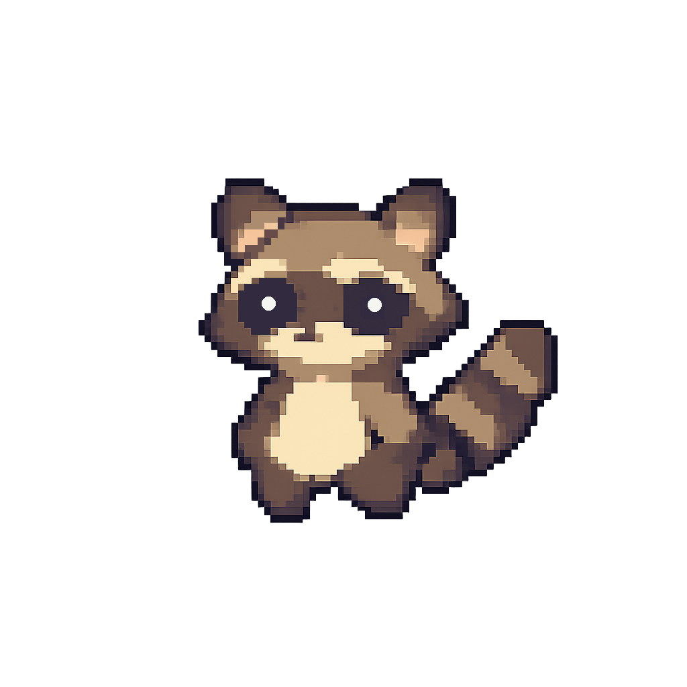

# 👋 Oi, eu sou o Alan

Sou um dev em formação que curte aprender na prática, testar ideias e construir projetos enquanto evoluo minhas habilidades.  
Uso este GitHub como um espaço para experimentar, errar, acertar e ver minha própria evolução ao longo do tempo.

---

Nada aqui é só teoria — tudo faz parte do meu processo real de aprendizado.

 

---

## 🛠️ Tecnologias que tenho usado

  
  
  
  
  
  
  

---

## 🌱 Em constante evolução

Este perfil muda conforme eu aprendo coisas novas, crio projetos e melhoro os antigos.

---
